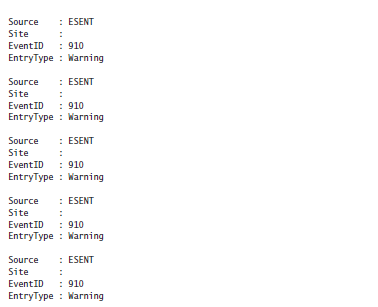
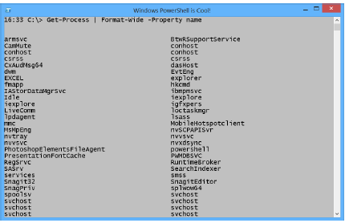

#Basic commands windows Powershell
-----------------------------------
Keep in mind, many Unix and DOS commands also work. These are the Powershell specific commands.
The unix and DOS commands simply point to powershell commands.
In addition, all Windows Native Commands also work in Powershell.

All powershell CMDlets were made using the same format: *verb-noun*

###Basic commands

|**Task**|**command**|**Notes**
|---|---|---|   
|Go to different folder|*Set-location* **Path**||
|List items in current directory|*get-ChildItem||
|Clear the screen|*clear-host*|shortcut: *cls*
|Create new directory in current directory|*md* **directory name**|
|Creates a record of all or part of a Windows PowerShell session in a text file|*start-transcript*|Powershell will show where the file is located|
|The Stop-Transcript cmdlet stops a transcript that was started by using the Start-Transcript cmdlet|*stop-transcript*|Closing Powershell will also stop the transcript|
|Creates Windows PowerShell commands in a graphical command window|*show-command*|Requires a parameter *-Name*, with a CMDlet|

###The help System

|**Task**|**command**|**Notes**
|---|---|---|
|Displays information about Windows PowerShell commands and concepts|*Get-Help* **CMDLet**|This will scroll down to the bottom of the help page, if you'ld like to see it in chunks, not unlike *man* in unix, simply use *Help* **CMDLet**
||*-Online*|Will open up the webpage with the online helppage. Useful since *update-help* might give an error due to localisation
||*-ShowWindow*|This will open up the help page in a seperate windows
|Downloads and installs the newest help files on your computer|*update-help*|
||*-Force*|Overrides the once-per-day limitation, version checking, and the 1 GB per module limit|
||*-category*|Only show CMDlets from a certain category|

###Basic get commands

|**Task**|**command**|**Notes**
|---|---|---|
|List items in current directory|*get-ChildItem||
|Gets the aliases for the current session||*get-alias*
|Gets the processes that are running on the local computer or a remote computer|*get-process*
|Gets the services on a local or remote computer|*get-service*
|Gets the hotfixes that have been applied to the local and remote computers|*get-hotfix*
|Gets the basic network adapter properties|*get-netadapter*
|Get all possible commands|*get-command*||
||*-verb*|show all commands with the specified verb, can use wildcards|
||*-noun*|show all commands with the specified noun,  can use wildcards|
|Gets a connection profile|*get-netconnectionprofile*
|Gets the current culture set in the operating system|*get-culture*|show keyboard layout and display format|
|Gets the current user interface (UI) culture settings in the operating system|*get-uiculture*
|Gets the current date and time|*get-date*
|Gets a random number, or selects objects randomly from a collection|*get-random*
|Gets the execution policies for the current session|*Get-executionPolicy*|
||*-list*|Gets all execution policy values for the session listed in precedence order|

###Common parameters
|**Task**|**Parameter**|**Notes**
|---|---|---|
|obtain additional information about the action a cmdlet performs|*-Verbose*
|Determines how the cmdlet responds to a non-terminating error from the command|*-ErrorAction|Requires an additional **string** to signify how it wants to deal with the error|
||*Continue*|Displays the error message and continues executing the command. The default option|
||*Ignore*|Suppresses the error message and continues executing the command
||*Inquire*|Displays the error message and prompts you for confirmation before continuing execution
||*SilentlyContinue*|Suppresses the error message and continues executing the command
||*Stop*|Displays the error message and stops executing the command

###Formatting output

When you use *get-process* you get a list which contains 8 different properties. There are however many more which aren't shown. Using *format-table* you can show the information that you require.

All of these commands, obviously, are used with the pipeline.

######formatting a table

Input: *Get-Process | Format-Table -Property name, handles, vm, ws*

Output:this returns the list of the processes with the specified properties.

If you'ld like a list of all available properties, etc. use *get-member*

Parameter: *-AutoSize*

Output: To fix the output, you need to add the -AutoSize parameter to the
end of the Format-Table command. The -Autosize parameter causes Format-Table to wait until
all data is available, and then the space between columns reduces to fit the actual size of the
data contained in the columns.

Parameter: *-Wrap*

Output: To display the overly long display names, use the -Wrap parameter in addition to using the
-AutoSize parameter.

######Creating a list

When you want to see all the properties and associated values returned by a particular command,
using *Format-List* is the easy way to display the information.

Input: *Get-EventLog application -N 5 | Fl s*,e**

Output: this command uses the abbreviated version of many parameters and CMDlets. However, it is quite straight forward. Of the 5 newest application logs, a list is made of all properties starting with s or e.

######creating a wide display

If your only interested in showing 1 property you can use the *format-wide* CMDlet.

This will show all properties in a 2-column list.

Input: *Get-Process | Format-Wide -Property name*

######Create an interactive grid

Input: *gps | Out-GridView*

###Storing Output

######Store in text file

Storing an output to a text file is very simple

Input: *CMDlet >>path*

If you use the same commands afterwards it will append the information to the file. If you'ld simple like to overwrite the file simply use *>* instead of *>>*

######Storing to .csv file

After a plain text file, the next level of complexity is a Comma Separated Value (.csv) file. Actually,
by using the Export-CSV cmdlet, creating a .csv file is not very complicated.

The most important thing to remember when creating a .csv file is that if you want to open it
in Microsoft Excel or import it to SQL or some other application, use the -NoTypeInformation
switched parameter to avoid writing a line of type information to the top of the file. The following example shows this technique of avoiding type information by using the NoTypeInformation
switch when collecting process information:
Input: *Get-Process | Export-Csv -Path c:\fso\process.csv -NoTypeInformation*

###Info Script execution policy
By default, Windows PowerShell disallows the execution of scripts. Typically, Group Policy
controls script support. If it does not, and if you have administrator rights on your computer,
you can use the Windows PowerShell *Set-ExecutionPolicy* cmdlet to turn on script support.
You can enable one of six levels by using the Set-ExecutionPolicy cmdlet. (The discussion of
Windows PowerShell scripts begins in Chapter 10). The following list shows the options:
* Restricted Does not load configuration files or run scripts. Restricted is the default.
* AllSigned Requires that a trusted publisher sign all scripts and configuration files,
including scripts that you write on the local computer.
 RemoteSigned Requires that a trusted publisher sign all scripts and configuration
files downloaded from the Internet.
* Unrestricted Loads all configuration files and runs all scripts. If you run an unsigned
script that was downloaded from the Internet, you are prompted for permission before
it runs.
* Bypass Nothing is blocked and there are no warnings or prompts.
* Undefined Removes the currently assigned execution policy from the current scope.
This parameter does not remove an execution policy that is set in a Group Policy
scope.

In addition to six levels of execution policy, there are three different scopes for the execution policies:
* Process The execution policy affects only the current PowerShell process.
* CurrentUser The execution policy affects only the current user.
* LocalMachine The execution policy affects all users of the computer.

######Summarized
|**Task**|**Command**|**Notes**
|---|---|---|
|Changes the user preference for the Windows PowerShell execution policy|*set-executionPolicy*||
||*-Scope*|
||*-ExecutionPolicy|

To set the LocalMachine execution policy, you must have administrator rights on the local
computer.

###Powershell profiles
The reason to learn about setting the Windows PowerShell script execution policy, as discussed
in the preceding section, is that a Windows PowerShell profile is a script. In fact, it is
a special script because it has a specific name and resides in a specific place. In this way, the
Windows PowerShell profile is similar to the old-fashioned Autoexec.bat file: It has a special
name, resides in a special location, and contains commands to customize the environment.

There are actually six different Windows PowerShell profiles, but for now you can create
a Windows PowerShell profile for the current user and the current Windows PowerShell
environment. The `$profile` automatic variable always points to the current user and current
Windows PowerShell environment Windows PowerShell profile.

