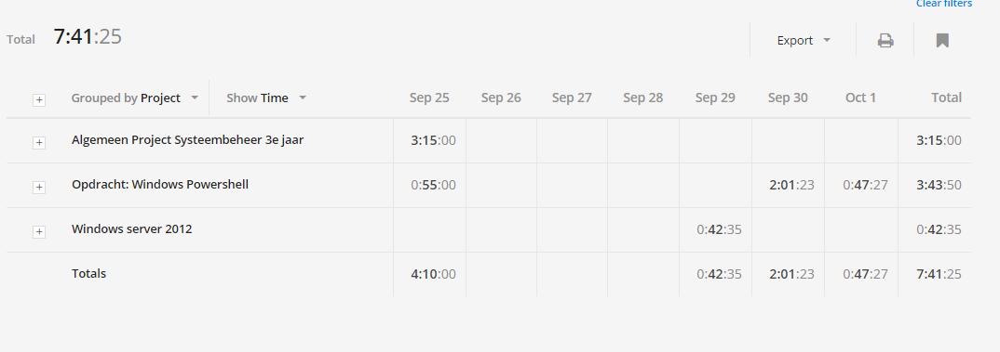

# Voortgangsrapport week 1

* Groep: 5
* Datum: 2/10/2015

| Student  | Aanw. | Opmerking |
| :---     | :---  | :---      |
| Kjeld Antjon |       |           |
| Matthias Derudder |       |           |
| Frederik Van Brussel |       |           |
| Daan Van Hecke |       |           |

## Wat heb je deze week gerealiseerd?

### Algemeen

[Afbeelding huidige toestand Kanban-bord(en) invoegen]

* ...
* ...

[Afbeelding teamoverzicht tijdregistratie onderverdeeld per deelopdracht]

### Kjeld Antjon

* Algemene administratie: opzetten werkomgeving.
* Windows Server: Online course Microsoft Powershell Jump Start 3.0: Chapter 1 t.e.m. 4

### Student 2

* ...

[Afbeelding individueel rapport tijdregistratie]

### Student 3

* ...

[Afbeelding individueel rapport tijdregistratie]

### Student 4

* ...

[Afbeelding individueel rapport tijdregistratie]

## Wat plan je volgende week te doen?

### Algemeen
### Kjeld Antjon

* De online course van Microsoft Powershell Jump Start 3.0 afwerken.
* Beginnen met lezen boek Powershell.

### Student 2
### Student 3
### Student 4

## Waar hebben jullie nog problemen mee?

* ...
* ...

## Feedback technisch luik

### Algemeen

### Student 1
### Student 2
### Student 3
### Student 4

## Feedback analyseluik

### Algemeen

### Student 1
### Student 2
### Student 3
### Student 4

