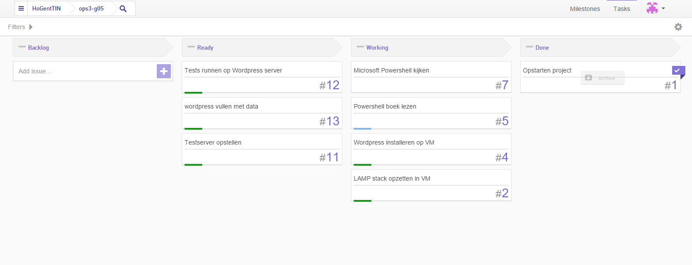

# Voortgangsrapport week nn

* Groep: 5
* Datum: 9/10/2015

| Student  | Aanw. | Opmerking |
| :---     | :---  | :---      |
| Kjeld Antjon |       |           |
| Matthias Derudder |       |           |
| Frederik Van Brussel |       |           |
| Daan Van Hecke |       |           |

## Wat heb je deze week gerealiseerd?

### Algemeen

* ...
* ...

### Kjeld Antjon

* Windows powershell Jumpstart 3.0 course afgewerkt
* Start Powershell boek: PS 3.0 First steps

### Student 2

* ...

[Afbeelding individueel rapport tijdregistratie]

### frederik van brussel

* Powershell filmpjes kijken
* wordpress plugins zoeken
* lampstack finetunen

### Student 4

* ...

[Afbeelding individueel rapport tijdregistratie]

## Wat plan je volgende week te doen?

### Algemeen
### Student 1
### Student 2
### Student 3
### Student 4

## Waar hebben jullie nog problemen mee?

* ...
* ...

## Feedback technisch luik

### Algemeen

### Student 1
### Student 2
### Student 3
### Student 4

## Feedback analyseluik

### Algemeen

### Student 1
### Student 2
### Student 3
### Student 4

