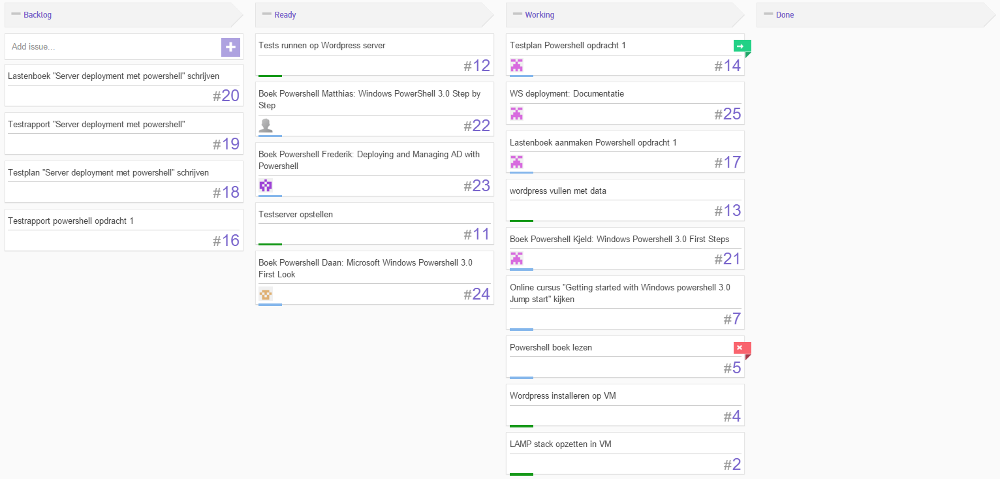
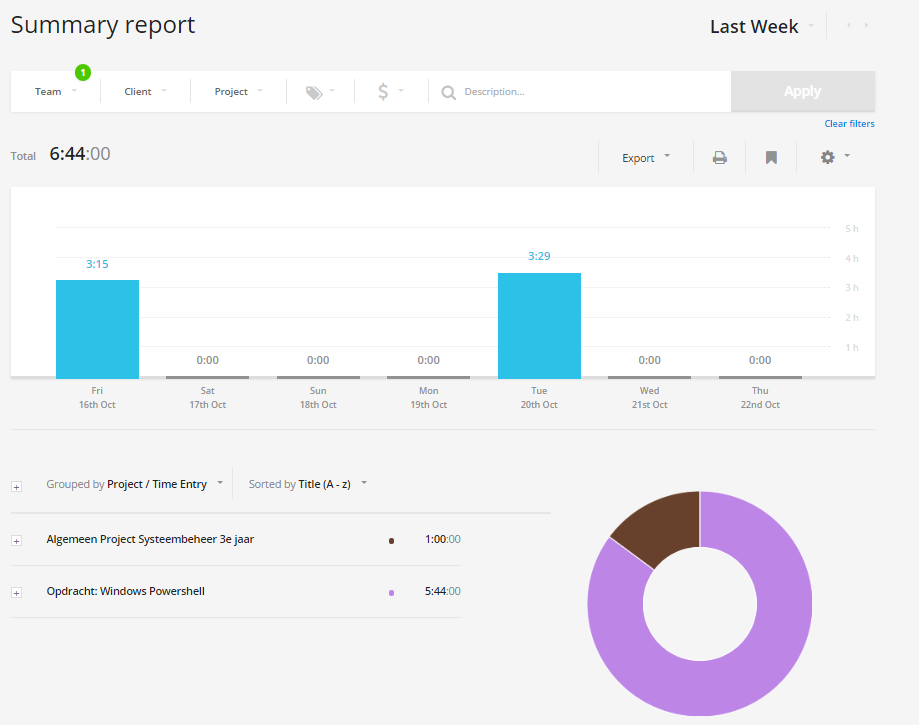

# Voortgangsrapport week 5

* Groep: 5
* Datum: 23/10/2015

| Student  | Aanw. | Opmerking |
| :---     | :---  | :---      |
| Kjeld Antjon |       |           |
| Matthias Derudder |       |           |
| Frederik Van Brussel |       |           |
| Daan Van Hecke |       |           |

## Wat heb je deze week gerealiseerd?

### Algemeen

* ...
* ...

### Kjeld Antjon

* Starten documentatie WS deployment opdracht
* Powershell boek: First Steps: Afwerken tem hoofdstuk 8

### Matthias Derudder

* Documenteren Windows PowerShell
* PowerShell boek: Step By Step uitgelezen
* Microsoft Virtual Academy: Using PowerShell for Active Directory

### Frederik Van Brussel

* ...

[Afbeelding individueel rapport tijdregistratie]

### Daan Van Hecke

* Collectd afwerken.
* Server opvullen met informatie.
* Grafana installeren om collectd te visualiseren.

## Wat plan je volgende week te doen?

### Algemeen
### Kjeld Antjon

* Afwerken boek Powershell + Starten implementatie van WS deployment
* 
### Matthias Derudder
### Frederik Van Brussel
### Daan Van Hecke
* De informatie visualiseren via Grafana.

## Waar hebben jullie nog problemen mee?

* ...
* ...

## Feedback technisch luik

### Algemeen

### Kjeld Antjon
### Matthias Derudder
### Frederik Van Brussel
### Daan Van Hecke

